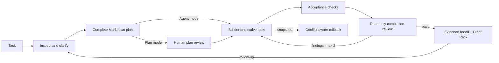

# TraceForge

[](https://github.com/iamzwxyy/traceforge/actions/workflows/ci.yml)

TraceForge is a local coding agent that makes completion evidence visible. It keeps a coding task
as a multi-turn conversation, works through a bounded set of native tools, runs explicit acceptance
checks, and asks an independent read-only completion reviewer to judge the result.

The project is intentionally focused: no pet, plugin market, hosted execution, or IDE clone.
Its differentiator is a defensible engineering loop with useful human control.

中文使用说明、完整功能状态和需求追踪见 [功能手册](FEATURES.md)。

## Why it stands out

- **Material clarification, not guesswork.** Complex requests can pause for one to three
  questions, each with mutually exclusive options and a recommended choice.
- **Agent by default, Plan when requested.** Normal tasks inspect, plan internally, implement, and
  verify without a plan-approval ceremony. Plan mode is an explicit composer toggle that always
  pauses on a complete downloadable Markdown plan before implementation.
- **Permission boundaries remain independent.** Routine work inside the workspace proceeds; an
  undeclared file, unknown command, or dangerous operation still asks or is denied regardless of
  whether Plan mode is enabled.
- **Plan as a completion contract.** Planned files, builder progress, check status, exact commands,
  and evidence stay visible. A write outside the declared file scope pauses for action approval.
- **Independent completion review.** The reviewer cannot write files or run commands. A rejection
  returns concrete findings to the builder for at most two repair cycles.
- **Downloadable Proof Pack.** One auditable Markdown artifact joins the persisted final diff,
  fresh checks, verifier verdict, conflict-aware rollback state, event ledger, and SHA-256
  integrity fingerprints.
- **Conversation without losing the Trace.** Follow-up prompts continue the same task and preserve
  prior turn summaries, workspace, and evidence. The main feed reads like a coding conversation;
  the exact plan, tools, checks, and review stay one click away in a collapsed Trace and inspector.
- **Low-friction workspaces.** The app starts without a workspace argument. A direct task
  automatically receives an isolated folder under the visible `Documents/TraceForge` root;
  existing code is selected inside the UI. Projects use macOS's native folder picker when
  available and keep their runs nested under a collapsible folder. Neither mode uploads files.
- **Layered, inspectable command isolation.** Routine and planned commands run under macOS
  Seatbelt or Linux Bubblewrap when available; the UI and Proof Pack distinguish enforced,
  user-approved bypass, and policy-only execution instead of presenting approval as a sandbox.
- **Recoverable execution.** Runs and events survive in SQLite. Bounded, visible model retries
  pause safely on a persistent transient outage; connection settings can be repaired before
  resuming. File snapshots support conflict-aware rollback without overwriting later user edits.
- **Model-aware context limits.** Each run snapshots the capacity resolved from an explicit user
  override, an exact official-endpoint model entry, or a conservative fallback. Compaction counts
  tool schemas, keeps tool requests paired with their results, and never assigns a large window
  from a fuzzy model-name match.

## Try the complete demo

Requirements: macOS or Linux, Python 3.12, and [uv](https://docs.astral.sh/uv/).
No API key or Node.js installation is needed for the packaged demo.

```bash
git clone https://github.com/iamzwxyy/traceforge.git
cd traceforge
uv sync --locked --all-extras
uv run traceforge demo
```

Open <http://127.0.0.1:8765>. The task is prefilled. Start it, choose the recommended API
compatibility option, approve the plan, and watch TraceForge repair a real cross-tenant cache
isolation bug. The demo changes a disposable copy, executes four real Pytest tests, and produces
a read-only verifier verdict. Open **Proof Pack** on the evidence board to inspect or download the
complete delivery record. This command is intentionally a fixed tour: the prefilled task is
read-only and unrelated prompts are rejected instead of being silently mapped onto the demo.

## Run against your own workspaces

TraceForge accepts an OpenAI-compatible Chat Completions endpoint with native tool calling.
It can launch before credentials are configured, and the application no longer binds itself to a
command-line workspace:

```bash
uv run traceforge
```

The first launch creates `Documents/TraceForge` as the visible root for isolated direct tasks and
opens the local UI in your browser. Use `traceforge serve --no-open-browser` in a headless shell.
Open existing code from **添加项目** in the UI; each run is sandboxed against its actual direct-task
directory or selected project root, not the application startup directory. `traceforge serve`
remains an explicit alias, and `--workspace /absolute/path` remains an optional advanced override
for the direct-task root.

`uv run traceforge doctor` is an optional preflight. It checks direct-task-root and state-directory
writes, SQLite startup/migrations, the packaged web bundle, listen-address availability, OS sandbox
enforcement, and the configured credential source without printing its value. Missing model setup
is a warning because the UI can configure it. For a strict preflight after configuration, add
`--require-os-sandbox --probe-model`; the latter makes one real native tool-call request and fails
if the selected model cannot complete it.

Open <http://127.0.0.1:8765>, then use the settings button to choose the model, compatible base
URL, and API key. TraceForge atomically writes the key to an owner-only (`0600`) file in its local
data directory; SQLite saves only that file's absolute path, and the value is never returned by
the API or UI. Advanced users may instead reference an existing one-line owner-only credential
file or set a model's documented context window. Leaving the context field empty uses an exact
catalog entry only for a recognized model on its official endpoint; all other routes use the
configurable conservative fallback. The resolved value and its source remain visible in settings.

Click **新建任务** to enter only the request; press Enter to submit or Shift+Enter for a newline.
The optional **计划模式** toggle is off by default. Leave it off for the normal Agent flow, or
turn it on when you want to review and download the plan before any implementation. TraceForge
creates a unique task directory beneath the visible default root. Click **添加项目** to select a
reusable project root in the application, then use the plus button beside that folder for
project-scoped tasks. Direct runs stay at the top level. After a
turn finishes, use the bottom composer to continue in the same task; each follow-up can choose its
own Agent or Plan mode.

Environment variables remain available as a non-persisted fallback:

| Variable | Required | Purpose |
| --- | --- | --- |
| `OPENAI_API_KEY` | no | Fallback provider credential; never returned by the API or UI |
| `OPENAI_MODEL` | no | Defaults to `gpt-5.6-sol` |
| `OPENAI_BASE_URL` | no | OpenAI-compatible endpoint |
| `TRACEFORGE_CONTEXT_LIMIT` | no | Conservative token-window fallback for unrecognized routes; defaults to 64,000 |
| `TRACEFORGE_MODEL_TIMEOUT` | no | Per-attempt model timeout in seconds; defaults to 180 |
| `TRACEFORGE_WORKSPACE_ROOT` | no | Advanced override for the direct-task root |

Before the first real run, use **Test connection**. The probe requires the selected model to
complete a native function call, so a successful HTTP response alone is not treated as readiness.

## How a run works



The model proposes actions; TraceForge owns the state machine, message history, tool dispatch,
permissions, local execution, persistence, context compaction, retries, and termination. It does
not use an agent framework or provider-hosted file/code tools.

See [Architecture](docs/architecture.md), [Security model](docs/security.md),
[Sandbox evidence](docs/sandbox.md), [AIME UI benchmark](docs/ui-benchmark.md),
[Fault-injection evidence](docs/fault-injection.md), [Quality corpus](docs/quality-evaluation.md),
[real-model evaluation](docs/real-model-evaluation.md), and [Interview guide](docs/interview-guide.md)
for the design rationale and failure semantics.

## Development

Frontend sources require Node.js 22 and pnpm 11. The production bundle is committed under the
Python package so end users still need only Python.

```bash
uv sync --locked --all-extras
pnpm install --frozen-lockfile

uv run ruff check src tests scripts
uv run mypy src
uv run pytest --cov=traceforge --cov-report=term -q

pnpm --filter traceforge-web lint
pnpm --filter traceforge-web typecheck
pnpm --filter traceforge-web test --run
pnpm --filter traceforge-web build
pnpm --filter traceforge-web e2e

# Five user-risk scenarios with a readable scorecard
uv run python scripts/evaluate_quality.py

# Stricter release-host check: fail when no OS sandbox is enforced
uv run python scripts/evaluate_quality.py --require-os-sandbox

# Optional low-frequency provider acceptance; never runs in CI
uv run python scripts/evaluate_real_model.py --credential-file /absolute/path/to/key
```

The current suite has 127 backend tests at 86.90% coverage (with a hard 85% gate), eight frontend
unit tests, and three serial Chrome tests covering the full evidence loop, automated WCAG A/AA checks,
keyboard-safe dialogs and drawers, responsive layouts, and reload recovery. Dependencies are locked; CI also
runs an Ubuntu quality job and a macOS smoke job.

## Repository map

```text
src/traceforge/       agent core, tools, persistence, API, CLI, packaged UI
web/                  React workbench and Playwright test
demo/tenant-cache-api bundled real-task fixture
tests/                unit, adversarial, integration, recovery, and API tests
docs/                 architecture, security, and interview rationale
scripts/              tracked-file credential scan
evaluation/           pinned real-model repair fixtures
```

## Scope and limitations

TraceForge v0.1 supports one active run per workspace and can run independent workspaces
concurrently on macOS/Linux. It is local-first and not a multi-user service. OS isolation is
backend-dependent: Seatbelt is built into supported macOS systems; Linux requires a working,
non-setuid Bubblewrap installation. The header reports a visible **仅策略限制** state when no
backend passes its startup probe. A user can explicitly approve an unknown command for one
unsandboxed execution, which is recorded as a bypass. Binary file editing, Windows, parallel
agents, browser automation, and plugin systems are outside v0.1.

Licensed under the [MIT License](LICENSE).
