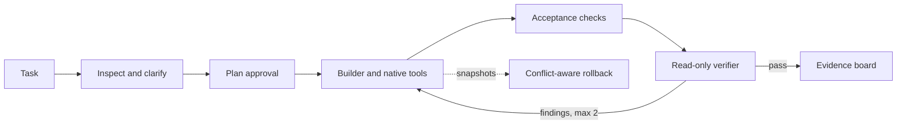

# TraceForge

[](https://github.com/iamzwxyy/traceforge/actions/workflows/ci.yml)

TraceForge is a local coding agent that makes completion evidence visible. It turns a request
into an approved plan, works through a bounded set of native tools, runs explicit acceptance
checks, and asks an independent read-only verifier to judge the result.

The project is intentionally focused: no pet, plugin market, hosted execution, or IDE clone.
Its differentiator is a defensible engineering loop with useful human control.

## Why it stands out

- **Material clarification, not guesswork.** Complex requests can pause for one to three
  questions, each with mutually exclusive options and a recommended choice.
- **Plan as a completion contract.** No mutation starts before plan approval. Builder progress,
  check status, exact commands, and evidence stay visible.
- **Independent verification.** The verifier cannot write files or run commands. A rejection
  returns concrete findings to the builder for at most two repair cycles.
- **Evidence-first UI.** Timeline, unified diff, check output, verdict, approvals, Stop, Resume,
  and Rollback are available in one local web workbench.
- **Low-friction workspaces.** Start a direct task in the last-used directory, or register a
  project when several runs should share a stable root. Neither mode copies or uploads files.
- **Safety by construction.** Paths are workspace-bounded, symlink escapes and `.git` writes are
  rejected, commands never use a shell, and dangerous operations are denied.
- **Recoverable execution.** Runs and events survive in SQLite. File snapshots support
  conflict-aware whole-run rollback without overwriting later user edits.

## Try the complete demo

Requirements: macOS or Linux, Python 3.12, and [uv](https://docs.astral.sh/uv/).
No API key or Node.js installation is needed for the packaged demo.

```bash
git clone https://github.com/iamzwxyy/traceforge.git
cd traceforge
uv sync --locked --all-extras
uv run traceforge demo
```

Open <http://127.0.0.1:8765>. The task is prefilled. Start it, choose the recommended API
compatibility option, approve the plan, and watch TraceForge repair a real cross-tenant cache
isolation bug. The demo changes a disposable copy, executes four real Pytest tests, and produces
a read-only verifier verdict.

## Run against your own workspaces

TraceForge accepts an OpenAI-compatible Chat Completions endpoint with native tool calling.
It can launch before credentials are configured:

```bash
uv run traceforge serve --workspace /absolute/path/to/project --port 8765
```

Open <http://127.0.0.1:8765>, then use the settings button to choose the model, compatible base
URL, and a local credential file. The file must contain exactly one line and have owner-only
permissions (`chmod 600`). TraceForge saves only its absolute path; the credential value is read
when constructing the provider and is never returned by the API or UI.

The composer defaults to a direct task and remembers its last directory. Select **Project** to
open an existing directory or create a new empty one as a reusable project root.

Environment variables remain available as a non-persisted fallback:

| Variable | Required | Purpose |
| --- | --- | --- |
| `OPENAI_API_KEY` | no | Fallback provider credential; never returned by the API or UI |
| `OPENAI_MODEL` | no | Defaults to `gpt-5.6-sol` |
| `OPENAI_BASE_URL` | no | OpenAI-compatible endpoint |
| `TRACEFORGE_CONTEXT_LIMIT` | no | Token-window estimate; defaults to 64,000 |

Before the first real run, use **Test connection**. The probe requires the selected model to
complete a native function call, so a successful HTTP response alone is not treated as readiness.

## How a run works



The model proposes actions; TraceForge owns the state machine, message history, tool dispatch,
permissions, local execution, persistence, context compaction, retries, and termination. It does
not use an agent framework or provider-hosted file/code tools.

See [Architecture](docs/architecture.md), [Security model](docs/security.md), and
[Interview guide](docs/interview-guide.md) for the design rationale and failure semantics.

## Development

Frontend sources require Node.js 22 and pnpm 11. The production bundle is committed under the
Python package so end users still need only Python.

```bash
uv sync --locked --all-extras
pnpm install --frozen-lockfile

uv run ruff check src tests scripts
uv run mypy src
uv run pytest --cov=traceforge --cov-report=term -q

pnpm --filter traceforge-web lint
pnpm --filter traceforge-web typecheck
pnpm --filter traceforge-web test --run
pnpm --filter traceforge-web build
pnpm --filter traceforge-web e2e
```

The current suite has 69 backend tests with a hard 85% coverage gate, frontend unit tests, a
full Chrome demo test, locked dependencies, an Ubuntu quality job, and a macOS smoke job.

## Repository map

```text
src/traceforge/       agent core, tools, persistence, API, CLI, packaged UI
web/                  React workbench and Playwright test
demo/tenant-cache-api bundled real-task fixture
tests/                unit, adversarial, integration, recovery, and API tests
docs/                 architecture, security, and interview rationale
scripts/              tracked-file credential scan
```

## Scope and limitations

TraceForge v0.1 supports one active run per workspace and can run independent workspaces
concurrently on macOS/Linux. It is local-first, not a multi-user service or an OS sandbox.
Approved project commands execute with the current user's permissions, so the exact argv and risk
reason are always shown for unknown actions. Binary file editing, Windows, parallel agents,
browser automation, and plugin systems are outside v0.1.

Licensed under the [MIT License](LICENSE).
