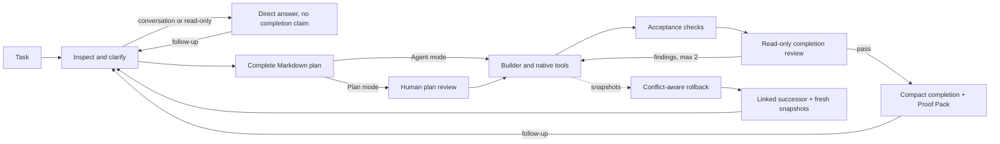

# TraceForge

[](https://github.com/iamzwxyy/traceforge/actions/workflows/ci.yml)

TraceForge is a local coding agent that makes completion evidence visible. It keeps a coding task
as a multi-turn conversation, works through a bounded set of native tools, runs explicit acceptance
checks, and asks an independent read-only completion reviewer to judge the result.

The project is intentionally focused: no pet, plugin market, hosted execution, or IDE clone.
Its differentiator is a defensible engineering loop with useful human control.

中文使用说明、完整功能状态和需求追踪见 [功能手册](FEATURES.md)。

## Why it stands out

- **Natural answers before workflow.** Greetings, capability questions, general explanations, and
  explicit read-only analysis end as an honest answer with no fabricated plan or proof. A
  clarification card appears only after executable intent is clear and a material choice remains.
- **Agent by default, Plan when requested.** Executable tasks inspect, plan internally, implement,
  and verify without a plan-approval ceremony. Plan mode is an explicit composer toggle that
  pauses on a complete downloadable Markdown plan whenever implementation is actually needed.
- **Three explicit action-permission profiles.** Manual asks before every edit or command;
  Automatic (the default) applies deterministic local rules; Full access is deliberately scoped
  to the workspace and enforced OS sandbox. All three remain independent from Agent/Plan mode,
  while hard destructive commands, real-path boundaries, and credential scrubbing stay invariant.
- **Plan as a completion contract.** Planned files, builder progress, check status, exact commands,
  and evidence stay visible. A write outside the declared file scope pauses for action approval.
- **Independent completion review.** The reviewer cannot write files or run commands. A rejection
  returns concrete findings to the builder for at most two repair cycles.
- **Downloadable Proof Pack.** Every successful turn atomically freezes an immutable v2 artifact
  joining its persisted completion diff, fresh checks, verifier verdict, conflict-aware rollback
  state, bounded event ledger, and layered SHA-256 integrity fingerprints. Later answers, failures,
  cancellations, rollbacks, or workspace edits cannot rewrite that historical turn. JSON and
  Markdown can select an exact successful turn, while legacy gaps stay honestly unavailable.
  The visible run, controls, errors, Diff, event stream, and Proof response
  are owned by the selected task, so a late network response cannot be projected or acted on beneath
  another task's title.
- **Conversation without losing the Trace.** Follow-up prompts continue the same task and preserve
  prior turn summaries, workspace, and evidence. The main feed reads like a coding conversation;
  each terminal answer has one canonical conversation event and names the files actually changed
  by native edit tools in that turn, while the
  cumulative task diff, exact plan, tools, checks, and review stay one click away.
- **Truthful streaming output.** Direct answers and implementation summaries grow in one stable
  bubble while their redacted deltas are persisted. A provider-complete draft stays visibly
  provisional until the turn commits it; retry, cancellation, truncation, and verifier rejection
  keep partial attempts separate and never duplicate the canonical result. Restart recovery closes
  every uncommitted stream generation, while answer/failure/cancellation commits cannot expose a
  terminal run with an unfinished turn.
- **Durable human decisions.** Clarification, plan review, and action approval are bound to stable
  request IDs and persisted before HTTP acknowledgement. Exact retries are idempotent; stale or
  conflicting replies cannot answer a later prompt, and resumed replies pair with the exact source
  tool call. Approved actions commit their execution-start marker with the consumed decision, so
  restart recovery never guesses by replaying a side effect.
- **Conversation-first completion.** A compact completion footer reports passed checks and keeps
  Proof Pack one click away without letting a large evidence dashboard bury the delivered answer.
  The left history panel and default-collapsed right details panel are resizable, keyboard
  operable, responsive, and locally persistent.
- **Low-friction workspaces.** The app starts without a workspace argument. A direct task
  automatically receives an isolated folder under the visible `Documents/TraceForge` root;
  existing code is selected inside the UI. Projects use macOS's native folder picker when
  available and keep their runs nested under a collapsible folder. Neither mode uploads files.
  A run-scoped **Open directory** action reveals the exact task workspace in Finder, or the local
  Linux file manager when a graphical session is available.
- **Layered, inspectable command isolation.** Routine and planned commands run under macOS
  Seatbelt or Linux Bubblewrap when available; the UI and Proof Pack distinguish enforced,
  user-approved bypass, and policy-only execution instead of presenting approval as a sandbox.
- **Recoverable execution.** Runs and events survive in SQLite. Bounded, visible model retries
  pause safely on a persistent transient outage; connection settings can be repaired before
  resuming. File snapshots support conflict-aware rollback without overwriting later user edits.
  Continuing after rollback creates one linked successor with a fresh snapshot boundary, so a
  later rollback restores the post-rollback workspace rather than the original pre-task files.
- **Model-aware context limits.** Each run snapshots the capacity resolved from an explicit user
  override, an exact official-endpoint model entry, or a conservative fallback. Compaction counts
  tool schemas, keeps tool requests paired with their results, and never assigns a large window
  from a fuzzy model-name match.
- **Per-turn, model-aware reasoning effort.** The composer shows only the effort levels supported
  by the exact official endpoint/model route in a compact native discrete picker; a sole capability
  becomes an explicit fixed chip, and model default is not presented as a lowest point on a slider.
  Model default omits the wire field, unknown compatible
  routes remain default-only, and one frozen choice is used by planner, builder, and verifier
  without exposing provider-private reasoning.

## Try the complete demo

Requirements: macOS or Linux, Python 3.12, and [uv](https://docs.astral.sh/uv/).
No API key or Node.js installation is needed for the packaged demo.

```bash
git clone https://github.com/iamzwxyy/traceforge.git
cd traceforge
uv sync --locked --all-extras
uv run traceforge demo
```

Open <http://127.0.0.1:8765>. The task is prefilled. Start it, choose the recommended API
compatibility option, approve the plan, and watch TraceForge repair a real cross-tenant cache
isolation bug. The demo changes a disposable copy, executes four real Pytest tests, and produces
a read-only verifier verdict. Open **查看证据** in the compact completion footer to inspect or
download the complete Proof Pack. This command is intentionally a fixed tour: the prefilled task
is read-only and unrelated prompts are rejected instead of being silently mapped onto the demo.

## Run against your own workspaces

TraceForge accepts an OpenAI-compatible Chat Completions endpoint with native tool calling.
It can launch before credentials are configured, and the application no longer binds itself to a
command-line workspace:

```bash
uv run traceforge
```

The first launch creates `Documents/TraceForge` as the visible root for isolated direct tasks and
opens the local UI in your browser. Use `uv run traceforge serve --no-open-browser` in a headless shell.
Open existing code from **添加项目** in the UI; each run is sandboxed against its actual direct-task
directory or selected project root, not the application startup directory. `uv run traceforge serve`
remains an explicit alias, and `--workspace /absolute/path` remains an optional advanced override
for the direct-task root. One owner-only lock protects each local data directory: a second launch
reuses a healthy same-version instance only when its random identity and launch configuration also
match, instead of rebuilding the application or rewriting active run state. A bounded readiness
wait covers the first process's pre-health startup window, while an older TraceForge process without
the new lock protocol is detected and refused rather than bypassed on another port. An unrelated
process on the requested port fails before startup mutation and prints a copyable command with an
available port.

`uv run traceforge doctor` is an optional preflight. It checks direct-task-root and state-directory
writes, SQLite startup/migrations, the packaged web bundle, listen-address availability, OS sandbox
enforcement, and the configured credential source without printing its value. Missing model setup
is a warning because the UI can configure it. For a strict preflight after configuration, add
`--require-os-sandbox --probe-model`; the latter makes one real native tool-call request and fails
if the selected model cannot complete it.

Open <http://127.0.0.1:8765>, then use the settings button to choose the model, compatible base
URL, and API key. **测试并保存** keeps the draft key in request memory until the native tool-call
probe succeeds, then writes it to a new owner-only (`0600`) file and atomically swaps the saved
configuration. Managed keys live in a dedicated owner-only (`0700`) directory that rejects symbolic
links; similarly named user-supplied credential files are never treated as managed files. The
separate save-only path can retain an unverified draft for later testing but
does not enable tasks. SQLite saves only the credential file's absolute path, and the value is never
returned by the API or UI.
Advanced users may instead reference an existing one-line owner-only credential
file or set a model's documented context window. Leaving the context field empty uses an exact
catalog entry only for a recognized model on its official endpoint; all other routes use the
configurable conservative fallback. The resolved value and its source remain visible in settings.
Settings also advertise the exact route's reasoning-effort options and catalog source. This is a
small allowlist, not model-name guessing: an unknown model or custom gateway offers only **模型默认**
and TraceForge sends no `reasoning_effort` field. The OpenAI allowlist covers the exact `gpt-5.6`
alias and Sol/Terra/Luna variants, `gpt-5.5`, `gpt-5.4`/Mini/Nano, `gpt-5.3-codex`, and `gpt-5`;
the DeepSeek allowlist covers the official V4 Flash/Pro/Flash Vision Exp routes.

Click **新建任务** to enter only the request; press Enter to submit or Shift+Enter for a newline.
The optional **计划模式** toggle is off by default. Leave it off for the normal Agent flow, or
turn it on when you want to review and download the plan before any implementation. TraceForge
also exposes a separate action-permission picker: **手动审批** confirms every edit/command,
**自动审批** runs planned routine work and asks on drift, and **完全访问（工作区）** auto-handles
workspace-scoped edits while retaining the path guard. It removes unknown-command prompts only
when an OS sandbox is enforced; on a policy-only host, those commands fall back to human
confirmation. Full access is per-turn and never becomes the next turn's silent default.
The adjacent **思考强度** picker is independent from those controls. It preserves the exact sparse
order declared for the selected route rather than inventing intermediate slider values. A supported explicit level is
frozen for the whole turn and carried through planning, building, and completion review; follow-up
turns may choose again. OpenAI routes receive the exact Chat Completions value. DeepSeek routes map
**关闭** to disabled thinking and supported non-default levels to enabled thinking. TraceForge does
not silently retry with a lower or omitted level when the route rejects the request. DeepSeek's
private replay field never appears in the UI or Proof Pack; terminal persistence is allowed only
after the field is scrubbed and SQLite confirms that the WAL was truncated.
TraceForge creates a unique task directory beneath the visible default root. Click **添加项目** to select a
reusable project root in the application, then use the plus button beside that folder for
project-scoped tasks. Direct runs stay at the top level. After a
turn finishes, use the bottom composer to continue in the same task; each follow-up can choose its
own Agent/Plan and action-permission modes. In either mode, conversational or read-only requests can answer directly;
the UI labels that terminal state separately from evidence-backed completion.
After rollback, the same composer creates and selects a linked successor task instead. The old run
remains immutable audit history, and the successor snapshots the current workspace; exact request
retries return that same successor rather than creating parallel branches.

The right **任务详情** panel starts collapsed so the conversation stays primary. Use the header
buttons to toggle either side panel, drag their separators (or use arrow/Home/End keys) to resize,
and click **打开目录** in a task header to reveal its local workspace. Panel preferences persist
on desktop; narrow windows use temporary drawers without overwriting those preferences.

Environment variables remain available as a non-persisted fallback:

| Variable | Required | Purpose |
| --- | --- | --- |
| `OPENAI_API_KEY` | no | Fallback provider credential; never returned by the API or UI |
| `OPENAI_MODEL` | no | Defaults to `gpt-5.6-sol` |
| `OPENAI_BASE_URL` | no | OpenAI-compatible endpoint |
| `TRACEFORGE_CONTEXT_LIMIT` | no | Conservative token-window fallback for unrecognized routes; defaults to 64,000 |
| `TRACEFORGE_MODEL_TIMEOUT` | no | Per-attempt model timeout in seconds; defaults to 180 |
| `TRACEFORGE_WORKSPACE_ROOT` | no | Advanced override for the direct-task root |

Before the first real run, use **测试并保存**. The probe exercises the unsaved draft in memory and
requires the selected model to complete a native function call, so a successful HTTP response
alone is not treated as readiness. Only a successful probe atomically replaces the saved route
and credential reference; a rejected draft and its raw key are not persisted. Saving without a
probe deliberately clears readiness, and new tasks, follow-ups, and resumes remain disabled until
the current saved connection has been verified.

## How a run works



The model proposes actions; TraceForge owns the state machine, message history, tool dispatch,
permissions, local execution, persistence, context compaction, retries, and termination. It does
not use an agent framework or provider-hosted file/code tools.

See [Architecture](docs/architecture.md), [Security model](docs/security.md),
[Sandbox evidence](docs/sandbox.md), [AIME UI benchmark](docs/ui-benchmark.md),
[Fault-injection evidence](docs/fault-injection.md), [Quality corpus](docs/quality-evaluation.md),
[real-model evaluation](docs/real-model-evaluation.md), and [Interview guide](docs/interview-guide.md)
for the design rationale and failure semantics.

## Development

Frontend sources require Node.js 22 and pnpm 11. The production bundle is committed under the
Python package so end users still need only Python.

```bash
uv sync --locked --all-extras
pnpm install --frozen-lockfile

uv run ruff check src tests scripts
uv run mypy src
uv run pytest --cov=traceforge --cov-report=term -q

pnpm --filter traceforge-web lint
pnpm --filter traceforge-web typecheck
pnpm --filter traceforge-web test --run
pnpm --filter traceforge-web build
pnpm --filter traceforge-web e2e

# Six user-risk scenarios with a readable scorecard
uv run python scripts/evaluate_quality.py

# Stricter release-host check: fail when no OS sandbox is enforced
uv run python scripts/evaluate_quality.py --require-os-sandbox

# Optional low-frequency provider acceptance; never runs in CI
uv run python scripts/evaluate_real_model.py \
  --credential-file /absolute/path/to/key \
  --reasoning-effort high
```

The current suite has 434 backend tests at 87.62% coverage (with a hard 85% gate), 28 frontend
unit tests, and 29 serial Chrome tests covering the full evidence loop, automated WCAG A/AA checks,
keyboard-safe dialogs and drawers, responsive layouts, and reload recovery. Dependencies are locked; CI also
runs an Ubuntu quality job and a macOS smoke job.

## Repository map

```text
src/traceforge/       agent core, tools, persistence, API, CLI, packaged UI
web/                  React workbench and Playwright test
demo/tenant-cache-api bundled real-task fixture
tests/                unit, adversarial, integration, recovery, and API tests
docs/                 architecture, security, and interview rationale
scripts/              tracked-file credential scan
evaluation/           pinned real-model repair fixtures
```

## Scope and limitations

TraceForge v0.1 supports one active run per workspace and can run independent workspaces
concurrently on macOS/Linux. It is local-first and not a multi-user service. OS isolation is
backend-dependent: Seatbelt is built into supported macOS systems; Linux requires a working,
non-setuid Bubblewrap installation. The header reports a visible **仅策略限制** state when no
backend passes its startup probe. A user can explicitly approve an unknown command for one
unsandboxed execution in the default Automatic profile, which is recorded as a bypass. The
workspace Full-access profile is not host-wide `danger-full-access`; it retains the OS sandbox and
falls back to a prompt for unknown commands when enforcement is unavailable. Binary file editing, Windows, parallel
agents, browser automation, and plugin systems are outside v0.1.

Licensed under the [MIT License](LICENSE).
