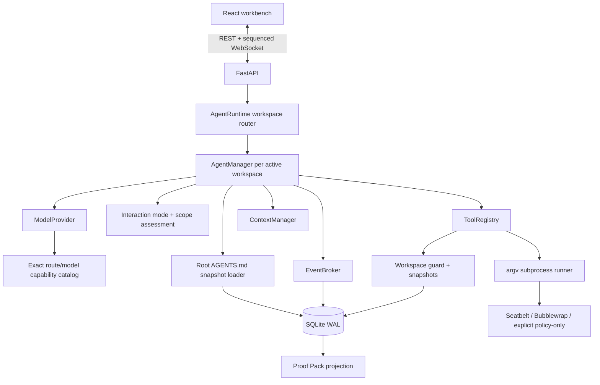
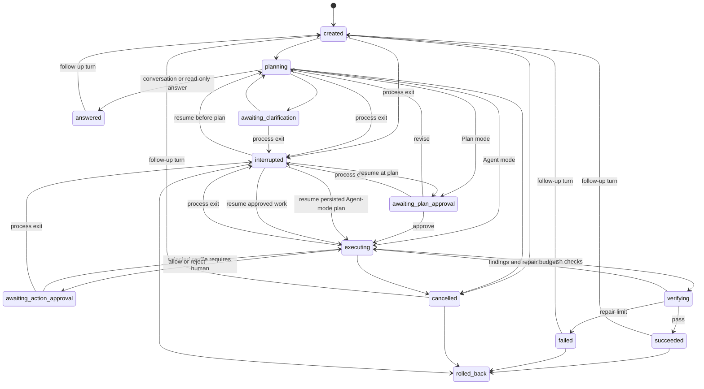

# TraceForge architecture

## Design objective

TraceForge optimizes for a claim that can be defended: “the requested change is complete because
these files changed, these checks passed, and an independent component reviewed the same
evidence.” The local application therefore treats state, tool results, diffs, and verification as
first-class data rather than rendering a chat transcript around an opaque model loop.

## Component boundaries

- `ModelProvider` translates OpenAI-compatible tool calls, streamed Chat Completion chunks, and the
  selected route's reasoning controls. It does not own the loop, public-output policy, or effort
  selection; providers without streaming retain the complete-response protocol.
- `resolve_reasoning_capability` matches the official HTTPS endpoint and exact model ID before it
  advertises any non-default effort. Unknown compatible routes omit the field instead of guessing.
- `AgentRuntime` resolves canonical workspace roots and lazily creates one manager per directory,
  allowing independent workspaces to progress concurrently without overlapping writers.
- `AgentManager` is the product core: phases, approvals, retries, evidence freshness, repair
  cycles, cancellation, resume, and completion.
- `assess_plan_gate` is a deterministic risk projection over the task and structured plan. The
  selected interaction mode—not a model claim—decides whether implementation pauses for review.
- `ToolRegistry` defines and executes the bounded local capability surface.
- `WorkspaceInstructionLoader` safely captures the exact root `AGENTS.md` into a private,
  turn-indexed snapshot before a new turn exists. The model sees it as a separate user-role
  guidance message; public projections receive only a manifest.
- `ToolRegistry.assess` produces an invariant base decision; `resolve_permission` applies the
  persisted per-turn `ApprovalMode` without ever upgrading a hard denial.
- `CommandSandbox` probes an OS backend and constructs a per-command profile; it returns structured
  enforcement metadata even when execution is policy-only or explicitly bypassed.
- `Workspace` resolves paths, records the first pre-change snapshot, creates diffs, and rolls back.
- `EventBroker` persists an event before publishing it, so reconnecting clients cannot miss a
  transition.
- FastAPI exposes public run views without internal model messages or credentials.

## State machine

Transitions are allowlisted. Invalid public actions return a conflict rather than silently
changing state. `InteractionMode` does not add states for action permissions: Manual/Automatic/
workspace Full access all reuse the same optional `awaiting_action_approval` gate. A process shutdown
records the previous phase and never automatically replays an incomplete tool call. On explicit
resume, a durable pending decision reopens and an accepted decision is consumed from its stored
receipt. An unmatched assistant tool call receives a synthetic failure before the model is called
again, preserving the provider protocol. Resume also validates the interrupted turn's frozen
reasoning effort against the newly configured route. An incompatible route leaves the run
interrupted rather than silently downgrading the request. `rolled_back` has no same-run transition:
continuation creates a separate linked run with a fresh snapshot namespace.

## Answer, clarify, plan, build, verify

### Planning

Before the first provider request, the host creates a structured `RequestResolution` for the active
`ConversationTurn`. It records whether the work is conversation, read-only, executable, or
fail-safe `undetermined`; whether
it depends on workspace contents; whether its target reference is absent, unspecified, explicit,
inherited, workspace-wide, multiple, or another project; whether the target is unnecessary,
resolved, requires clarification, or is unsupported; target-routing ambiguity; whether
project-overview evidence is required; and bounded reasons. Requirements questions are separate:
each model-authored question declares its target, scope, constraint, or acceptance dimension,
material effect, rationale, and stable semantic key, while accepted answers are stored in
`ConversationTurn.resolved_clarifications`.
This projection is product state, not hidden model reasoning, and is returned as
`ConversationTurn.request_resolution`; the resolved target is returned separately as
`ConversationTurn.project_target`. Both fields remain nullable for legacy records and a turn that
has not reached resolution yet.

Classification is compositional rather than prompt-specific. The resolver combines speech act,
requested effect, local object evidence, verified project-name roles, clause polarity, and target
cardinality. It applies those dimensions to one canonical semantic text: fenced/inline code and
quoted literals governed as content are masked before either action or target extraction. Thus a
snippet that says “deploy beta” cannot authorize deployment or select `beta`, and a social prefix
such as “Hello,” cannot consume the real task that follows it. A bare project-like token plus a
generic semantic-subject question remains conservative; action-governed property/object shorthand,
possessive, locative, project-noun, action-target, comparison, and source/destination roles provide
stronger evidence. Candidate names that collide with action/object or common ecosystem vocabulary
need one of those stronger roles rather than being silently bound.

Every request the host classifies as workspace-dependent uses the same target resolver:
introductions, fixes, tests, searches, builds, deployments, and other reads or executions no longer
have separate target rules.
The host scans only filesystem names for stable project manifests. A verified explicit name or a
reliable adjacent reference resolves automatically to a `ProjectTarget`; a sole candidate may also
resolve automatically, while an explicit whole-workspace request binds the workspace root. A root
manifest makes that root a candidate beside direct-child projects, not an override. An unspecified
single-target request with multiple verified roots
produces a host-authored `project_scope` decision whose options come from the filesystem rather than
the model. Verified alternatives such as `alpha or beta` produce a picker bounded to those choices;
joint targets such as `alpha and beta`, parallel per-project properties, comparisons, and
source-to-destination transfers remain an unsupported one-root scope instead of being
misrepresented as a choice or narrowed to the last name. Negative polarity removes only the
non-selected branch (`beta instead of alpha`). Conversation, general-knowledge questions, and
ungoverned artifact names such as “What is package.json?” remain unscoped.

`ProjectTarget` persists the selected path, label, root markers, selection source, and
device/inode/ctime identity. Selection and decision consumption are atomic. A moved, deleted, or
replaced target stops the turn rather than silently selecting a sibling. Inheritance is
adjacent-turn and referential: an unrelated middle turn cannot revive a stale target, while a
reliable “this project” reference can carry the exact identity into a later read or execution.
Repeating an unqualified workspace-dependent request in a multi-project container reopens the
picker. Project selection does not consume either of the two requirements-clarification rounds.
The filesystem project-root semantic namespace is host-owned: model-authored requirements cannot
ask the user to select or reselect it on explicit, automatic, or conversation routes.

The target is bound into `ToolRegistry` as the virtual root for reads, writes, and commands. Native
list/read/search operations open the recorded root as a temporary `dirfd`, validate its identity,
and walk path components with `openat`-style `dir_fd` calls plus `O_NOFOLLOW`; scoped search uses the
same descriptor walker instead of passing a re-resolvable path to `rg`. Native writes resolve
against the same target boundary, and commands run with that project as their bounded working root.
For a child-project target, commands require OS enforcement: Seatbelt denies sibling-project data,
and Bubblewrap masks the containing workspace before exposing only the target. Path validation for
native writes and command launch is not yet fully descriptor-bound, so a hostile concurrent rename
after validation remains a documented TOCTOU boundary; the stronger rename-race claim applies only
to descriptor-relative reads and their post-read identity check.
The target never grants execution authority: plan scope, action-permission profiles, the real-path
guard, command policy, and OS sandbox are evaluated independently and remain mandatory.

Scoped reads still run away from the event loop. Listing streams a bounded number of entries
without retaining child descriptors; file reads bound line count, line size, file bytes, and
persisted output; search additionally bounds query length, regex execution time, files, tree
entries, and total scan bytes. A post-operation identity check discards buffered output when the
recorded path or directory generation changed, and incomplete walks are explicitly marked. Only
for a manifest-backed whole-project overview does `overview_required` require completion to include
a root listing and a successful root README or readable manifest read, including an Xcode
`project.pbxproj`.

After target resolution, the planning role can list, read, and search, then must choose one
structured terminal action.
`respond_to_user` ends greetings, general questions, explicit read-only analysis, or a remaining
blocker as `answered`, without a plan, verifier verdict, or Proof Pack. The Planner contract reserves
`ask_questions` for a material target, scope, constraint, or acceptance ambiguity that inspection
and trusted context cannot remove; it instructs the model not to ask about discoverable facts,
cosmetic preferences, greetings, or general knowledge. The host validates each question's declared
dimension, material effect, rationale, and semantic key, rejects a semantic key reissued under a
different question ID in the same turn, persists accepted answers, limits each round to three
questions with two to four options, and caps requirements clarification at two rounds. The Planner
is instructed to return non-executable clarification to focused inspection or `respond_to_user`.
The host applies an effect ceiling independently of model behavior: conversation routes cannot use
workspace reads or `submit_plan`; every read route can inspect but cannot submit a plan; executable
routes use the normal plan and action gates. An `undetermined` workspace task may inspect, clarify,
and propose a plan, but the host forces that plan to an explicit approval gate with at least medium
risk, even in Agent mode. The fallback is grammatical rather than one exact prompt: it covers
causative imperatives, obligation modals, desired-result frames, and Chinese 把 constructions, while
epistemic questions, explanations, learning, and advice remain conversation. Terminal actions
cannot be mixed with reads or with each other in one model response.

The regression corpus is a bounded deterministic Chinese/English prompt matrix. Cases cover
unspecified targets across overview, fix, test, search, and deploy intents; exact and adjacent
references; workspace, alternative, and joint targets; local versus general artifact names;
literal/snippet masking; explanatory, negated, and result-state actions; greetings; and general
knowledge. Each case asserts its expected route and target. Agent-level tests separately exercise
provider-call suppression, durable selection, host-owned target questions, semantic-key
deduplication, the `undetermined` approval ceiling, and multi-turn sequences.
These tests protect the enumerated semantic families rather than claiming a global natural-language
precision or recall score.

Model prose is public only after the runtime accepts a non-terminal inspection/tool round. Prose-only
contract violations, mixed terminal responses, and prose attached to `respond_to_user`, `finish`, or
`submit_verification` remain internal protocol history. For a streaming provider, only the string
field inside `respond_to_user.content` or `finish.summary` is eligible for the conversation surface.
The manager incrementally decodes that JSON string and persists `assistant.output.started`, numbered
`delta`, `completed`, and `aborted` lifecycle events. Each provider attempt has a fresh `stream_id`;
retry, cancellation, protocol rejection, missing checks, and verifier rejection can therefore never
merge a discarded draft into its successor. `completed` means the provider response was structurally
accepted but is still provisional. Only `turn.completed.final_stream_id` commits that same bubble as
the canonical answer or verified summary. A transport-truncated stream has no terminal finish reason;
a model-declared length truncation, bounded-output overflow, or malformed tool-argument object gets a
fresh stream identity and a safe bounded regeneration prompt. There is no complete-response fallback
after a partial attempt, and retry exhaustion still stops without accepting partial output.

The persisted `started` event is also the durable owner record for a stream generation. Until a
matching `aborted` event or a terminal turn links that ID, storage treats the generation as open—even
after `assistant.output.completed`. Startup aborts all such generations in the same transaction that
marks an unfinished run `interrupted`; failure, cancellation, resume, and rollback use the same
idempotent ledger scan. A validation error after provider completion therefore cannot strand a draft.
Provider-triggered and cleanup-triggered interruptions likewise commit owner aborts, the guarded run
update, optional error, and state event together. The provider enforces one wall-clock deadline across
stream creation and iteration, rejects compressed bodies, bounds HTTP bytes before JSON decoding,
closes the SDK transport on timeout/cancellation/boundary failure, honors bounded server retry hints,
surfaces refusal text, validates chunk types and finish reasons, and applies both per-field and
whole-stream budgets.

A successful SSE response that crosses the raw byte, event, line, or chunk guard is classified as a
bounded `response_limit`, not a malformed provider contract. It may receive the same finite concise
regeneration treatment while every per-attempt transport cap remains enforced. Oversized non-2xx
error bodies, compression, invalid lengths, and invalid stream shapes remain non-retryable protocol
failures.

Tool argument assembly accepts standard deltas plus monotonic cumulative snapshots used by some
OpenAI-compatible streams. An exact retransmission or a later fragment containing the complete
existing prefix replaces the prior snapshot; unrelated fragments remain concatenated and therefore
fail strict single-object JSON parsing. The provider raises a typed, redacted `tool_arguments` error,
and `AgentManager` spends the same application-owned retry budget on a temporary correction context
without persisting raw malformed output. Response-limit retries use the same mechanism. The event
ledger records only the category and regeneration strategy.

Before the returned `ModelResponse` can enter phase logic, `AgentManager` constructs a fresh
canonical response. Public prose and terminal presentation arguments are deep-redacted. Tool-call
IDs/names, private replay state, and non-terminal arguments are behavior-bearing, so a credential
match rejects the response before durable stream completion, history, approval, or dispatch. The
same boundary canonicalizes local `ToolResult` output/error/metadata before any event or model
history write. User-authored task and decision payloads cross an equivalent pre-persistence guard.

JSON then has one wire invariant across provider history, SQLite, REST, and WebSocket: a newline is
inserted at every semantic token boundary and the exact serialized string is checked for raw and
repeatedly escaped registered credentials plus token-shaped secrets. This second pass matters
because an adversarial key can otherwise be synthesized only when separately safe fields meet JSON
punctuation. `Storage` owns the in-memory credential set, the final persistence assertion, and the
public redaction/serialization projection; the key values themselves never enter SQLite. Snapshot
BLOBs are checked before insertion, while native edits check both old and proposed UTF-8 content
before snapshot or mutation.

The UI rebuilds each stream from persisted `(stream_id, segment_index)` identities, uses the full
completed content as a convergence record, and projects the linked terminal event into one stable
conversation item. Reconnect replay and duplicate events are idempotent. Older non-streaming runs
continue to use `turn.completed`, with a narrow compatibility projection for older same-turn
planning/building/verifying messages whose content exactly equals the terminal summary.

A validated `TaskPlan` contains steps, an explicit relative file scope, acceptance checks,
optional argv commands, and risks.

Malformed structured clarification or plan calls are returned as failed tool results with
field-level schema errors that omit invalid input values. They remain auditable and can be corrected
within the same bounded planning phase instead of terminating the run.

After validation, application code grades risk and records the reasons, but interaction mode owns
the pause semantics. Agent mode persists `agent_continues` and moves directly to implementation;
Plan mode persists `approval_required` and always waits, even for a one-file low-risk task. The
structured fields are materialized as one canonical Markdown document containing goal, approach,
steps, expected files, validation, and risks; `GET /api/runs/{id}/plan.md` downloads that exact
contract. A restart preserves the recorded decision. Any later file mutation outside
`impacted_files` remains a base-policy `ask`; Manual and Automatic pause, while workspace Full
access handles that soft decision automatically without disabling the Workspace guard. Skipping a
plan-review click never changes these action semantics.

### Durable human decisions

Clarification, plan review, and action approval use a SQLite `decision_requests` inbox. Opening a
gate atomically persists the waiting `RunRecord`, a unique request ID plus SHA-256 of the exact
question/plan/action, and the requested event. REST accepts only a response bound to that ID. It
canonicalizes and stores the payload before returning `202 Accepted`; an exact retry is idempotent,
while a changed payload, abandoned request, wrong kind, or old ID is rejected. The worker may then
consume the accepted receipt and the next state/events in one transaction, so a crash cannot leave
an HTTP-accepted answer only in an in-memory future. Clarification question IDs must be unique and
each submitted answer must contain exactly one option or one custom value. After restart, the
application reconstructs the latest unanswered assistant tool batch and pairs the stored
clarification or plan receipt with that exact source call, even if a provider reused a call ID in
an earlier batch.

For an approved external action, consuming the decision, clearing the pending card, entering
`executing`, and appending the approval resolution plus `tool.started` marker are one transaction.
The external tool starts only after that commit. If the process dies before consumption, explicit
resume can consume it once. If it dies after the marker but before a matching `tool.completed`, the
receipt becomes `uncertain` and the call is never replayed; the builder receives an inspect-first
recovery context. A rejected action's deterministic tool result and completion evidence are also
committed with decision consumption, so a crash cannot replace the user's rejection with generic
protocol repair. User cancellation abandons any still-pending or accepted receipt.

### Building

The builder receives the current turn, earlier turn summaries, and recorded plan. It can call six local file/process tools
plus the structured `update_plan` and `finish` controls. File mutations invalidate prior command
evidence. Before every consequential tool, the builder evaluates a two-stage permission result:
hard policy first, then the frozen per-turn profile. Manual asks on every native edit/command;
Automatic preserves the planned/read-only allow and unknown/drift ask behavior; workspace Full
access auto-handles soft asks but never disables invariant denials. Exact acceptance commands and
known read-only commands enter the OS sandbox when its probe succeeds. Non-writing,
non-interactive focused Pytest variants from the same launcher family also stay sandboxed without
another prompt, but only the exact planned argv refreshes acceptance evidence.

In Automatic mode, approving a base-policy unknown command grants one visibly recorded
unsandboxed invocation for compatibility. Manual confirmations retain the sandbox. Workspace Full
access auto-runs an unknown command only when OS enforcement is real and passes
`sandbox_bypass=False`; on a policy-only host it falls back to human approval. `finish` has a strict,
extra-forbidden schema, must be the only call in its model response, and is rejected until every
command-backed acceptance check has a fresh passing result. A response that mixes `finish` with an
action is rejected as one atomic batch, so call order cannot create partial side effects.

The loop has three independent brakes:

1. 30 non-terminal tool actions by default. Reaching the exact boundary leaves only `finish`
   available; an oversized batch is rejected before any call executes. If independent verification
   then rejects the result, the run fails explicitly because no repair action remains.
2. Two identical failures trigger a recovery instruction; a third ends the run.
3. A builder that twice responds without a tool or `finish` fails explicitly; three consecutive
   malformed, mixed, or over-budget batches also fail instead of looping indefinitely.

### Verifying

The verifier receives the current request, earlier turn summaries, recorded plan, current diff,
and recent persisted tool events. Its available local tools are read-only. Invalid structured reports are returned as tool
errors for correction. Mixed read-and-submit turns must finish the reads and submit one verdict in
a later turn, keeping Chat Completions tool-call/result ordering valid.

A `pass` completes the run. `fail` or `inconclusive` becomes a builder repair instruction. The
default repair budget is two; exhaustion produces an honest failed state. Repair cycles share the
same per-turn action budget rather than silently receiving unbounded extra tools.

## Evidence freshness

Every acceptance command is stored as an argv list, not a shell string. A successful result saves
its exit code and tail evidence on the matching check. Any later `apply_patch` or `create_file`
sets command-backed checks to pending with “files changed after the previous check.” This prevents
the agent from citing stale tests after a repair.

Tool output has two limits: at most 1 MiB is persisted and at most 16 KiB (head and tail) is sent
back to the model. The complete public status still includes exit code, timeout, truncation, argv,
working directory, and per-command sandbox metadata.

Native mutation tools fingerprint every canonical candidate path immediately before and after an
attempt. Their `ToolResult.metadata.changed_files` therefore contains only files whose bytes or
existence actually changed, including the successful prefix of a multi-file patch that later
fails. `AgentManager` merges that list into the active `ConversationTurn` and persists it before
diff events or repeated-failure termination. This is deliberately narrower than a full workspace
audit: `run_command` can mutate files, so the UI labels the list as native-edit-tool changes rather
than claiming it captures every command side effect.

## Proof Pack projection

Each successful turn stores one immutable `traceforge.proof-pack.v2` row keyed by `(run_id,
turn_index)`. The successful RunRecord, closed conversation turn, `state.changed`, `turn.completed`,
and `run.completed` events, and Proof row are committed in one SQLite transaction. The broker
publishes those already-persisted terminal events only after commit. A proof-construction failure,
state race, or conflicting pre-existing artifact rolls the entire transaction back, so readers
cannot observe `succeeded` without its frozen evidence.

The pack declares `scope=cumulative_through_turn` and its terminal `event_through_seq`. It includes
the plan and gate, cumulative snapshot paths, completion-event diff, fresh checks, independent
verdict, rollback capability at freeze time, per-turn counters, and command isolation aggregated
only through that boundary. Rejected or denied commands remain separate from executed commands.
Later answers, failures, cancellations, rollbacks, and workspace edits cannot rewrite an earlier
successful artifact.

`artifact_sha256` covers the complete public v2 JSON except the hash field itself. The semantic
evidence, event chain, and Diff retain separate hashes so consumers can compare the relevant layer.
These hashes detect accidental or post-export changes; they are not signatures or a defense
against a local user deliberately rewriting both SQLite and the artifact. Exact reads validate the
artifact and its storage identity before returning it.

`GET /api/runs/{id}/proof-pack?turn_index=N` and the matching Markdown route read an exact frozen
turn; omission selects the latest successful turn. Run views advertise actual stored turn indexes,
and Proof responses are `no-store`. A one-time migration may freeze a legacy run only while its
current state is still `succeeded`; a historical success already followed by another turn is left
unavailable rather than reconstructed from mutable current state. Startup backfill and stored-proof
reads do not construct a model provider or require credentials.

The browser treats run identity as part of every evidence value. Selecting a different run first
invalidates outstanding Diff and Proof generations and clears the prior projection. HTTP results
are committed only when both their run owner and request generation still match; a newer
`diff.updated` WebSocket event also invalidates an older in-flight Diff fetch. Socket callbacks are
likewise ignored after ownership changes, inbound events and Proof payloads must echo the requested
`run_id`, and task-scoped errors are exposed only while their owner remains selected. The visible
run is derived from the selected id and the run cache instead of being independent state. Actions
recheck that identity before dispatch, while `RunStage` is keyed by run id so form, confirmation,
and loading state cannot survive a task switch. This keeps transport and render timing from
relabeling one run's state or acting on another run.

## Reasoning effort and provider-private replay

`ReasoningEffort` is a per-turn input, separate from Agent/Plan interaction mode and action
permission. The API validates it before starting a worker, stores it on both the run mirror and the
immutable active-turn snapshot, and the manager reads the turn as the authority for every planner,
builder, retry, repair, and verifier request.

The capability resolver returns an ordered supported set, known provider default, catalog source,
and transport for one exact endpoint/model route. `auto` is universally safe and omits the wire
field. Recognized OpenAI Chat Completions routes send the chosen `reasoning_effort` unchanged.
The exact OpenAI catalog includes the `gpt-5.6` alias and Sol/Terra/Luna variants, `gpt-5.5`,
`gpt-5.4`/Mini/Nano, `gpt-5.3-codex`, and `gpt-5`; malformed endpoints and catalog misses remain
auto-only.
Recognized DeepSeek routes map `none` to `thinking.type=disabled`; low/high/max enable thinking and
send the matching effort. DeepSeek tool-call continuation omits `tool_choice`, preserves non-null
empty assistant content, and replays the response's `reasoning_content` exactly as its protocol
requires. There is no rejection-driven fallback that could change semantics between attempts.

Raw reasoning is provider-private transport state, not application evidence. It may be held in the
internal message history while an active DeepSeek turn needs it for a subsequent request. It is
removed for every non-DeepSeek transport, excluded from public run views/events/Proof Pack, and
scrubbed and saved while the run is still non-terminal. A checked WAL truncate must then succeed
before the terminal state is persisted. Checkpoint lock waits are disabled and retries have a
short bounded deadline. A busy WAL persists an internal cleanup-pending flag, moves the run to
`interrupted`, and prevents resume from calling the model until cleanup succeeds; there is no dead
worker paired with an apparently active row. Startup also resolves pending cleanup and scrubs
legacy terminal rows before serving them. Credential-like
private text fails the turn without persistence rather than being redacted into protocol-invalid
replay. `model.requested` exposes only safe metadata: turn, phase, attempt, model, requested level,
wire level or omission, thinking on/off/default, and capability source. The Proof Pack projects the
requested per-turn level but not wire omission or thinking state. The main activity feed excludes
these transport events from its default Trace projection, while the complete Timeline retains every
sequence entry under a generic user-facing model-call label.

## Context management

TraceForge resolves a context window for each route using a validated user override, an exact
official-endpoint/model catalog entry, or a conservative fallback, and snapshots that value on the
run. It estimates tokens deterministically from serialized UTF-8 bytes, including the current tool
schemas. At 80% pressure it retains the fixed system message and direct request—or the first three
messages when workspace guidance sits between them—selects a recent tail within 16% of the window,
and inserts a bounded evidence-oriented summary of the middle. Assistant tool calls remain paired
with their following tool results. Provider-private reasoning replay is never summarized or
projected to the UI and is scrubbed when the turn terminates.

Workspace guidance has its own deterministic context boundary. For v1, only an exact
workspace-root `AGENTS.md` is eligible. Its complete rendered message is capped at 32 KiB and is
inserted after the fixed system message but before the direct current request. That three-message
prefix is protected during compaction, then the private guidance message is removed again before
conversation history is persisted. Planner, Builder, and Verifier therefore use the same snapshot
without turning project prose into a system instruction. The framing states that safety remains
highest, the current request outranks conflicting project defaults, and guidance cannot grant
permissions or expand the workspace. The first statement is model-facing precedence rather than a
local semantic proof; the latter boundaries are enforced by tool policy.

Every new run and follow-up captures a fresh snapshot—an explicit empty snapshot when no file
exists—and commits it in the same SQLite transaction as the turn and its first events. Resume binds
the active tools to that exact stored hash and never rereads the filesystem. Any native edit or
command checks the current turn's persisted hash against the manager's in-memory binding before a
baseline, write, or process starts. Legacy interrupted turns without a snapshot are not resumable;
their user can stop the interrupted turn before following up, or start a new task instead.
The snapshot freezes automatic discovery and injection only. Root or nested `AGENTS.md` files remain
ordinary readable/editable workspace files; reading later disk content does not replace the marked
current-turn guidance snapshot.

A run is also a durable conversation. `ConversationTurn` records the request, selected Agent/Plan
mode, selected action-permission mode, selected reasoning effort, request resolution, project
target, resolved clarification answers, outcome, completion summary, native-edit files, and
timestamps. A terminal answered, successful, failed, or cancelled run can transition back to
`created` for a follow-up. The next planner receives the last six completed turn requests,
summaries, and structured resolved choices while keeping the same run id, project, workspace
snapshots, event ledger, and rollback boundary. Model protocol messages reset per turn so stale
tool-call state is not mixed into a new request.

Answer, failure, and cancellation close the active turn and publish `state.changed`,
`turn.completed`, and `run.completed` with the RunRecord in one guarded SQLite transaction. Success
adds its Proof Pack to that same boundary. A write fault therefore rolls every terminal projection
back to the prior non-terminal state instead of leaving a terminal run with an in-progress turn.
One deliberately destructive recovery handles an interrupted row whose formerly ordinary context
matches a newly selected provider credential. Because the normal serializer must reject that row,
the storage layer atomically abandons every active decision, clears model-facing subjects and
history, writes one neutral cancelled turn, and emits the same terminal event boundary with no
provider or tool call. Workspace file snapshots and the immutable workspace-instruction snapshot
remain untouched. The run is terminal before the old row bytes are checkpointed from SQLite WAL, so
a busy external reader leaves a cleanup marker for startup rather than keeping the workspace active.
Resume preflight evaluates the persisted row together with the exact sealed-guidance insertion, so
a compact-JSON credential assembled only between those messages is rejected synchronously while the
run remains interrupted. Provider credentials shorter than 12 UTF-8 bytes, or equal to an
unavoidable recovery-protocol representation, are rejected before a manager can register them.
After destructive recovery, the next follow-up uses `max(turn.index) + 1`; retained snapshot rows
therefore cannot collide even when the neutral projection keeps a later turn number.

Rollback intentionally ends that snapshot lineage. A follow-up from `rolled_back` creates one
successor run UUID recorded in `run_lineage`; exact retries return the same successor and a
different branch request conflicts. The successor keeps the project/workspace association but
snapshots files under its own run ID. Its planner receives bounded predecessor turn summaries with
an explicit warning that they are historical intent/evidence and that current disk contents are
authoritative. This prevents a later successor rollback from restoring the original pre-parent
bytes over edits the user made after the first rollback.

## Persistence and recovery

SQLite uses WAL mode. Its core tables include:

- `runs`: public state, optional project association, current interaction, action-permission, and
  reasoning-effort mirrors, conversation turns,
  internal messages, plan and scope assessment, approval state, and interrupted origin;
- `events`: per-run monotonically increasing sequence and JSON payload;
- `snapshots`: original bytes, mode, original hash, and last agent-written hash per path;
- `workspace_instruction_snapshots`: insert-only private root-rule content, provenance, and semantic
  hash keyed by run and turn; this persistence path never directly copies the prose into `runs` or
  rule-manifest events, although a provider may independently quote model-visible rules;
- `decision_requests`: request subject/payload hashes, pending/accepted/consumed/abandoned/uncertain
  status, and the approved-action execution-start boundary;
- `run_lineage`: the one-to-one rolled-back parent → successor relationship;
- `proof_packs` and conservative backfill markers: immutable successful-turn evidence;
- `projects`: reusable display names and canonical local root directories;
- `provider_config`: one model/base-URL/credential-file reference plus the last successful native
  tool-call verification time, never the secret value. In the atomic test-and-save path, a draft
  raw key remains in request memory during its probe and is materialized as a new owner-only
  managed file inside a dedicated owner-only directory only after success; the explicit save-only
  path persists it as unverified;
- `preferences`: small local UI choices such as the last direct-task workspace.

Startup migrations add compatible columns to early v0.1 databases. The credential-boundary
migration abandons every pre-boundary pending/accepted action decision and clears its pending
subject plus replay messages, so an old approval cannot become executable after restart. Historical
databases abandon every pending or accepted clarification, plan, or action decision whose turn
predates immutable workspace-guidance snapshots. Historical events and immutable Proof Packs are not rewritten because
their hashes are evidence; public reads
still redact the currently registered key and standard token shapes. WebSocket clients request
events after their last sequence; the server replays persisted rows before subscribing to new
ones. One workspace permits one active or interrupted run to avoid overlapping writes; different
workspaces use separate managers and may run concurrently. Before constructing FastAPI or opening
SQLite, `serve` takes an owner-only non-following lock for the data directory and pre-binds its
listener. The owner publishes a random instance identity, local URL, version, and a fingerprint of
the canonical workspace/host/port configuration. A second launch reuses the holder only when all
of those fields and the identity returned by `/healthz` match. It waits for a bounded interval
across the owner's pre-publish and pre-health windows, and can take over after an owner exits. An
unreachable or mismatched holder, a detected older instance without this lock protocol, or an
occupied port fails without touching run state. Only the lock owner proceeds to startup recovery,
where every unfinished run is marked interrupted before any workspace manager is created. The same
SQLite transaction
appends a `state.changed` event with the previous phase and `cause=process_restart`, so the recovery
audit cannot disagree with the run row. Resume appends a `run.resumed` event with its
application-selected strategy, preserved decision behavior, uncertain approvals, and the number of
incomplete tool calls closed without replay. Pending and accepted decisions remain request-bound
across restart; only explicit user cancellation abandons them. A verifier rejection similarly
appends `repair.started` before builder work continues. See
[Fault-injection evidence](fault-injection.md) for the deterministic failure matrix.

## Rollback algorithm

For every touched path, TraceForge records the original state only once and updates the last-agent
hash after each mutation. Rollback compares the current file hash with that last-agent hash:

- already equal to the recorded original state: record the same restoration/removal result again;
- equal and originally present: restore bytes and POSIX mode;
- equal and originally absent: remove the generated file and empty generated directories;
- different: report a conflict and preserve the user's later edit.

This is deliberately safer than `git reset`: it works in non-Git folders and never overwrites a
post-agent user change. Recognizing an already-restored target makes a full retry—or a retry after a
mid-batch filesystem failure—result-idempotent. The filesystem is not part of the SQLite
transaction: rollback first abandons any active human decision, then processes files, then commits
the `rolled_back` state, any interrupted turn closure, and complete `rollback.completed` result
atomically. Resume and rollback
share the per-run lifecycle lock, so a newly registered worker and a rollback cannot cross.

After rollback, the parent snapshot set is never reused. Its single successor takes a fresh first
snapshot from the then-current file bytes, and the parent/child IDs are exposed in run views so the
UI can navigate the immutable audit record without offering a second branch.

## HTTP and event surface

The same-origin service defaults to `127.0.0.1`. REST manages direct-task directories, projects,
provider references, exact reasoning-capability metadata, atomic draft connection probes, and run controls; it returns current state/diff/events,
adds follow-up turns, downloads Markdown plans, and resolves request-bound clarification, plan, or
action decisions. `202` means the canonical response is durably queued, not merely placed in an
in-memory future. A rolled-back follow-up returns a new linked run; exact retries return the same
successor. The browser treats a successful mutation response as the commit boundary: it stores the
returned run/result immediately and performs synchronization refresh separately, so a failed GET
cannot unlock a card or resend a successful POST. Decision and rollback errors stay beside their
own controls, rollback success moves focus to its result, and successor conflicts refresh the
parent/list to reveal the already-created child. The
provider probe persists its draft only after native tool calling succeeds. Ordinary configuration
saves clear verification, and runtime methods serialize provider changes with starting, following
up, or resuming work; all three task entry points reject an unverified saved connection.
run-scoped `POST /api/runs/{id}/open-workspace` accepts no path from the browser: it re-resolves the
persisted canonical workspace, rejects symlink retargeting, and invokes Finder or `xdg-open` with a
fixed argv and scrubbed environment. JSON and Markdown Proof Pack routes expose exact immutable
successful-turn artifacts and disable HTTP caching. WebSocket pushes the persisted event stream.
Mutating HTTP requests reject untrusted
origins and cross-site fetch metadata; WebSocket origins are restricted to localhost, and
IPv4/IPv6 loopback origins share the same policy. Responses include CSP, frame denial, referrer,
and MIME-sniffing headers. The React production
build is part of the Python wheel.

## Why one agent loop

Parallel agents would add impressive diagrams but weaken attribution, rollback ownership, and
debuggability for this project's scope. A separate verifier creates meaningful independence at the
decision boundary without concurrent writes. The result is small enough to explain line by line in
an interview and complete enough to demonstrate real failure recovery.
