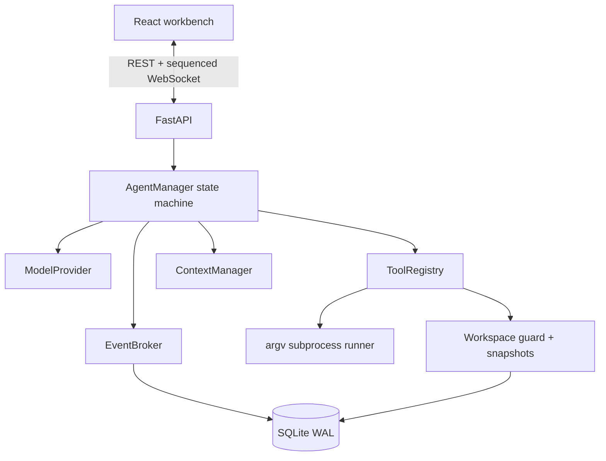
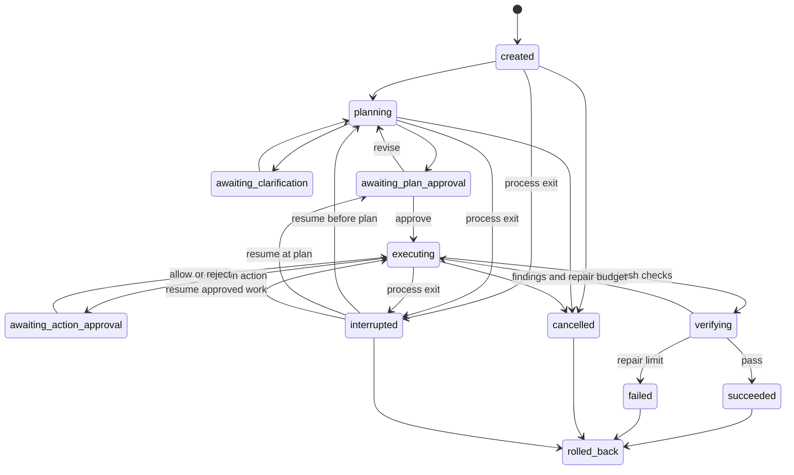

# TraceForge architecture

## Design objective

TraceForge optimizes for a claim that can be defended: “the requested change is complete because
these files changed, these checks passed, and an independent component reviewed the same
evidence.” The local application therefore treats state, tool results, diffs, and verification as
first-class data rather than rendering a chat transcript around an opaque model loop.

## Component boundaries

- `ModelProvider` only translates OpenAI-compatible tool calls. It does not own the loop.
- `AgentManager` is the product core: phases, approvals, retries, evidence freshness, repair
  cycles, cancellation, resume, and completion.
- `ToolRegistry` defines and executes the bounded local capability surface.
- `Workspace` resolves paths, records the first pre-change snapshot, creates diffs, and rolls back.
- `EventBroker` persists an event before publishing it, so reconnecting clients cannot miss a
  transition.
- FastAPI exposes public run views without internal model messages or credentials.

## State machine

Transitions are allowlisted. Invalid public actions return a conflict rather than silently
changing state. A process shutdown records the previous phase and never automatically replays an
incomplete tool call. On resume, any unmatched assistant tool call receives a synthetic failure
result before the model is called again, preserving the provider protocol.

## Clarify, plan, build, verify

### Planning

The planner can only list, read, and search. Material ambiguity is represented as structured
questions: at most three per round, two to four options per question, and at most two rounds. A
validated `TaskPlan` contains steps, acceptance checks, optional argv commands, and risks. The
user must approve it before mutation.

### Building

The builder receives the original task and approved plan. It can call six local file/process tools
plus the structured `update_plan` and `finish` controls. File mutations invalidate prior command evidence.
`finish` is rejected until every command-backed acceptance check has a fresh passing result.

The loop has three independent brakes:

1. 30 tool steps by default.
2. Two identical failures trigger a recovery instruction; a third ends the run.
3. A builder that twice responds without a tool or `finish` fails explicitly.

### Verifying

The verifier receives the original task, approved plan, current diff, and recent persisted tool
events. Its available local tools are read-only. Invalid structured reports are returned as tool
errors for correction. Mixed read-and-submit turns must finish the reads and submit one verdict in
a later turn, keeping Chat Completions tool-call/result ordering valid.

A `pass` completes the run. `fail` or `inconclusive` becomes a builder repair instruction. The
default repair budget is two; exhaustion produces an honest failed state.

## Evidence freshness

Every acceptance command is stored as an argv list, not a shell string. A successful result saves
its exit code and tail evidence on the matching check. Any later `apply_patch` or `create_file`
sets command-backed checks to pending with “files changed after the previous check.” This prevents
the agent from citing stale tests after a repair.

Tool output has two limits: at most 1 MiB is persisted and at most 16 KiB (head and tail) is sent
back to the model. The complete public status still includes exit code, timeout, truncation, argv,
and working directory metadata.

## Context management

TraceForge estimates tokens deterministically from serialized UTF-8 bytes. At 70% of the configured
window, and only when history is long enough, it retains the first two messages, the newest twelve,
and inserts an evidence-oriented summary of the middle. Tool names and bounded results are kept;
hidden reasoning is neither requested nor displayed.

## Persistence and recovery

SQLite uses WAL mode and three tables:

- `runs`: public state plus internal messages, plan approval, and interrupted origin;
- `events`: per-run monotonically increasing sequence and JSON payload;
- `snapshots`: original bytes, mode, original hash, and last agent-written hash per path.

Startup migrations add compatible columns to early v0.1 databases. WebSocket clients request
events after their last sequence; the server replays persisted rows before subscribing to new
ones. One workspace permits one active or interrupted run to avoid overlapping writes.

## Rollback algorithm

For every touched path, TraceForge records the original state only once and updates the last-agent
hash after each mutation. Rollback compares the current file hash with that last-agent hash:

- equal and originally present: restore bytes and POSIX mode;
- equal and originally absent: remove the generated file and empty generated directories;
- different: report a conflict and preserve the user's later edit.

This is deliberately safer than `git reset`: it works in non-Git folders and never overwrites a
post-agent user change.

## HTTP and event surface

The same-origin service defaults to `127.0.0.1`. REST creates and controls runs, returns current
state/diff/events, and resolves plan or action decisions. WebSocket pushes the persisted event
stream. Origins are restricted to localhost, and responses include CSP, frame denial, referrer,
and MIME-sniffing headers. The React production build is part of the Python wheel.

## Why one agent loop

Parallel agents would add impressive diagrams but weaken attribution, rollback ownership, and
debuggability for this project's scope. A separate verifier creates meaningful independence at the
decision boundary without concurrent writes. The result is small enough to explain line by line in
an interview and complete enough to demonstrate real failure recovery.
