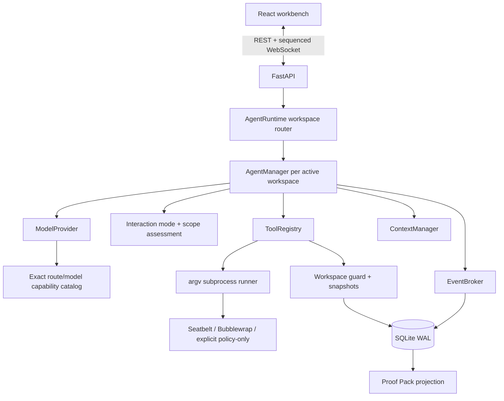
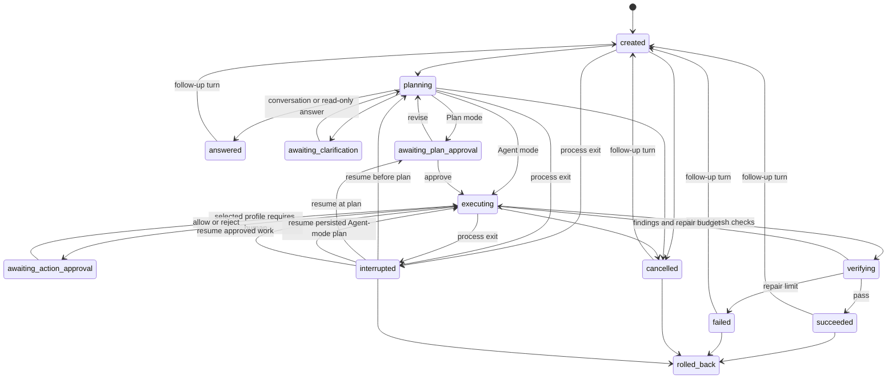

# TraceForge architecture

## Design objective

TraceForge optimizes for a claim that can be defended: “the requested change is complete because
these files changed, these checks passed, and an independent component reviewed the same
evidence.” The local application therefore treats state, tool results, diffs, and verification as
first-class data rather than rendering a chat transcript around an opaque model loop.

## Component boundaries

- `ModelProvider` only translates OpenAI-compatible tool calls and the selected route's reasoning
  controls. It does not own the loop or choose an effort level.
- `resolve_reasoning_capability` matches the official HTTPS endpoint and exact model ID before it
  advertises any non-default effort. Unknown compatible routes omit the field instead of guessing.
- `AgentRuntime` resolves canonical workspace roots and lazily creates one manager per directory,
  allowing independent workspaces to progress concurrently without overlapping writers.
- `AgentManager` is the product core: phases, approvals, retries, evidence freshness, repair
  cycles, cancellation, resume, and completion.
- `assess_plan_gate` is a deterministic risk projection over the task and structured plan. The
  selected interaction mode—not a model claim—decides whether implementation pauses for review.
- `ToolRegistry` defines and executes the bounded local capability surface.
- `ToolRegistry.assess` produces an invariant base decision; `resolve_permission` applies the
  persisted per-turn `ApprovalMode` without ever upgrading a hard denial.
- `CommandSandbox` probes an OS backend and constructs a per-command profile; it returns structured
  enforcement metadata even when execution is policy-only or explicitly bypassed.
- `Workspace` resolves paths, records the first pre-change snapshot, creates diffs, and rolls back.
- `EventBroker` persists an event before publishing it, so reconnecting clients cannot miss a
  transition.
- FastAPI exposes public run views without internal model messages or credentials.

## State machine

Transitions are allowlisted. Invalid public actions return a conflict rather than silently
changing state. `InteractionMode` does not add states for action permissions: Manual/Automatic/
workspace Full access all reuse the same optional `awaiting_action_approval` gate. A process shutdown records the previous phase and never automatically replays an
incomplete tool call. On resume, any unmatched assistant tool call receives a synthetic failure
result before the model is called again, preserving the provider protocol. A persisted pending
approval is first resolved as `abandoned` and cleared, so an old approval ID cannot authorize a
new or reconstructed action. Resume also validates the interrupted turn's frozen reasoning effort
against the newly configured route. An incompatible route leaves the run interrupted rather than
silently downgrading the request.

## Answer, clarify, plan, build, verify

### Planning

The planning role can list, read, and search, then must choose one structured terminal action.
`respond_to_user` ends greetings, general questions, explicit read-only analysis, or a remaining
blocker as `answered`, without a plan, verifier verdict, or Proof Pack. `ask_questions` is reserved
for a known implementation request whose material choice cannot be discovered: at most three
questions per round, two to four options per question, and at most two rounds. `submit_plan` begins
executable work only when enough context exists. Terminal actions cannot be mixed with reads or
with each other in one model response.

Model prose is public only after the runtime accepts a non-terminal inspection/tool round. Prose-only
contract violations, mixed terminal responses, and prose attached to `respond_to_user`, `finish`, or
`submit_verification` remain internal protocol history; the canonical user result is emitted once in
`turn.completed`. The UI keeps the append-only event ledger intact and applies a narrow compatibility
projection for older same-turn planning/building/verifying messages whose content exactly equals an
answered or succeeded summary.

A validated `TaskPlan` contains steps, an explicit relative file scope, acceptance checks,
optional argv commands, and risks.

Malformed structured clarification or plan calls are returned as failed tool results with
field-level schema errors that omit invalid input values. They remain auditable and can be corrected
within the same bounded planning phase instead of terminating the run.

After validation, application code grades risk and records the reasons, but interaction mode owns
the pause semantics. Agent mode persists `agent_continues` and moves directly to implementation;
Plan mode persists `approval_required` and always waits, even for a one-file low-risk task. The
structured fields are materialized as one canonical Markdown document containing goal, approach,
steps, expected files, validation, and risks; `GET /api/runs/{id}/plan.md` downloads that exact
contract. A restart preserves the recorded decision. Any later file mutation outside
`impacted_files` remains a base-policy `ask`; Manual and Automatic pause, while workspace Full
access handles that soft decision automatically without disabling the Workspace guard. Skipping a
plan-review click never changes these action semantics.

### Building

The builder receives the current turn, earlier turn summaries, and recorded plan. It can call six local file/process tools
plus the structured `update_plan` and `finish` controls. File mutations invalidate prior command
evidence. Before every consequential tool, the builder evaluates a two-stage permission result:
hard policy first, then the frozen per-turn profile. Manual asks on every native edit/command;
Automatic preserves the planned/read-only allow and unknown/drift ask behavior; workspace Full
access auto-handles soft asks but never disables invariant denials. Exact acceptance commands and
known read-only commands enter the OS sandbox when its probe succeeds. Non-writing,
non-interactive focused Pytest variants from the same launcher family also stay sandboxed without
another prompt, but only the exact planned argv refreshes acceptance evidence.

In Automatic mode, approving a base-policy unknown command grants one visibly recorded
unsandboxed invocation for compatibility. Manual confirmations retain the sandbox. Workspace Full
access auto-runs an unknown command only when OS enforcement is real and passes
`sandbox_bypass=False`; on a policy-only host it falls back to human approval. `finish` is rejected until
every command-backed acceptance check has a fresh passing result.

The loop has three independent brakes:

1. 30 tool steps by default.
2. Two identical failures trigger a recovery instruction; a third ends the run.
3. A builder that twice responds without a tool or `finish` fails explicitly.

### Verifying

The verifier receives the current request, earlier turn summaries, recorded plan, current diff,
and recent persisted tool events. Its available local tools are read-only. Invalid structured reports are returned as tool
errors for correction. Mixed read-and-submit turns must finish the reads and submit one verdict in
a later turn, keeping Chat Completions tool-call/result ordering valid.

A `pass` completes the run. `fail` or `inconclusive` becomes a builder repair instruction. The
default repair budget is two; exhaustion produces an honest failed state.

## Evidence freshness

Every acceptance command is stored as an argv list, not a shell string. A successful result saves
its exit code and tail evidence on the matching check. Any later `apply_patch` or `create_file`
sets command-backed checks to pending with “files changed after the previous check.” This prevents
the agent from citing stale tests after a repair.

Tool output has two limits: at most 1 MiB is persisted and at most 16 KiB (head and tail) is sent
back to the model. The complete public status still includes exit code, timeout, truncation, argv,
working directory, and per-command sandbox metadata.

Native mutation tools fingerprint every canonical candidate path immediately before and after an
attempt. Their `ToolResult.metadata.changed_files` therefore contains only files whose bytes or
existence actually changed, including the successful prefix of a multi-file patch that later
fails. `AgentManager` merges that list into the active `ConversationTurn` and persists it before
diff events or repeated-failure termination. This is deliberately narrower than a full workspace
audit: `run_command` can mutate files, so the UI labels the list as native-edit-tool changes rather
than claiming it captures every command side effect.

## Proof Pack projection

`GET /api/runs/{id}/proof-pack` assembles a versioned evidence projection from the run, snapshots,
and sequenced events. For completed work it prefers the diff stored in the completion event; for
earlier terminal states it uses the last persisted diff event, falling back to the live workspace
only when no persisted diff exists. Later user edits therefore do not rewrite a successful run's
historical delivery evidence. It also counts commands by enforced, bypassed, and policy-only
execution, while rejected or denied commands are counted separately as not executed. The exported
artifact therefore cannot imply stronger isolation—or more executed commands—than the event ledger
proves.

The projection includes the visible plan and gate, touched paths, final diff, fresh check results,
independent verdict, rollback outcome, counts, and two SHA-256 values: one for the event sequence
and one for the assembled evidence. The Markdown route renders the same projection as a download.
These hashes detect accidental or post-export changes; they are not signatures or a defense
against a local user deliberately rewriting both SQLite and the artifact.

Per-turn `changed_files` was added after the `traceforge.proof-pack.v1` digest surface. It is a UI
navigation hint rather than new signed evidence, so v1 turn serialization excludes the field;
the cumulative snapshot paths remain covered by the existing top-level `changed_files`. A future
artifact that signs per-turn attribution must use a new schema version instead of silently changing
v1 hashes.

Action-permission and reasoning-effort fields follow the same compatibility rule: the current
projection and Markdown display them, while the v1 stable evidence digest excludes the later-added
turn hints. Their `turn.started`, `turn.completed`, `tool.completed`, and `model.requested` events
remain covered by the event-chain digest.

The browser treats run identity as part of every evidence value. Selecting a different run first
invalidates outstanding Diff and Proof generations and clears the prior projection. HTTP results
are committed only when both their run owner and request generation still match; a newer
`diff.updated` WebSocket event also invalidates an older in-flight Diff fetch. Socket callbacks are
likewise ignored after ownership changes, inbound events and Proof payloads must echo the requested
`run_id`, and task-scoped errors are exposed only while their owner remains selected. The visible
run is derived from the selected id and the run cache instead of being independent state. Actions
recheck that identity before dispatch, while `RunStage` is keyed by run id so form, confirmation,
and loading state cannot survive a task switch. This keeps transport and render timing from
relabeling one run's state or acting on another run.

## Reasoning effort and provider-private replay

`ReasoningEffort` is a per-turn input, separate from Agent/Plan interaction mode and action
permission. The API validates it before starting a worker, stores it on both the run mirror and the
immutable active-turn snapshot, and the manager reads the turn as the authority for every planner,
builder, retry, repair, and verifier request.

The capability resolver returns an ordered supported set, known provider default, catalog source,
and transport for one exact endpoint/model route. `auto` is universally safe and omits the wire
field. Recognized OpenAI Chat Completions routes send the chosen `reasoning_effort` unchanged.
The exact OpenAI catalog includes the `gpt-5.6` alias and Sol/Terra/Luna variants, `gpt-5.5`,
`gpt-5.4`/Mini/Nano, `gpt-5.3-codex`, and `gpt-5`; malformed endpoints and catalog misses remain
auto-only.
Recognized DeepSeek routes map `none` to `thinking.type=disabled`; low/high/max enable thinking and
send the matching effort. DeepSeek tool-call continuation omits `tool_choice`, preserves non-null
empty assistant content, and replays the response's `reasoning_content` exactly as its protocol
requires. There is no rejection-driven fallback that could change semantics between attempts.

Raw reasoning is provider-private transport state, not application evidence. It may be held in the
internal message history while an active DeepSeek turn needs it for a subsequent request. It is
removed for every non-DeepSeek transport, excluded from public run views/events/Proof Pack, and
scrubbed and saved while the run is still non-terminal. A checked WAL truncate must then succeed
before the terminal state is persisted. Checkpoint lock waits are disabled and retries have a
short bounded deadline. A busy WAL persists an internal cleanup-pending flag, moves the run to
`interrupted`, and prevents resume from calling the model until cleanup succeeds; there is no dead
worker paired with an apparently active row. Startup also resolves pending cleanup and scrubs
legacy terminal rows before serving them. Credential-like
private text fails the turn without persistence rather than being redacted into protocol-invalid
replay. `model.requested` exposes only safe metadata: turn, phase, attempt, model, requested level,
wire level or omission, thinking on/off/default, and capability source. The Proof Pack projects the
requested per-turn level but not wire omission or thinking state. The main activity feed excludes
these transport events from its default Trace projection, while the complete Timeline retains every
sequence entry under a generic user-facing model-call label.

## Context management

TraceForge resolves a context window for each route using a validated user override, an exact
official-endpoint/model catalog entry, or a conservative fallback, and snapshots that value on the
run. It estimates tokens deterministically from serialized UTF-8 bytes, including the current tool
schemas. At 80% pressure it retains the first two messages, selects a recent tail within 16% of the
window, and inserts a bounded evidence-oriented summary of the middle. Assistant tool calls remain
paired with their following tool results. Provider-private reasoning replay is never summarized or
projected to the UI and is scrubbed when the turn terminates.

A run is also a durable conversation. `ConversationTurn` records the request, selected Agent/Plan
mode, selected action-permission mode, selected reasoning effort, outcome, completion summary,
native-edit files, and timestamps. A terminal answered, successful, failed, or
cancelled run can transition back to `created` for a follow-up. The next planner receives the last six completed
turn requests and summaries while keeping the same run id, project, workspace snapshots, event
ledger, and rollback boundary. Model protocol messages reset per turn so stale tool-call state is
not mixed into a new request.

## Persistence and recovery

SQLite uses WAL mode and six tables:

- `runs`: public state, optional project association, current interaction, action-permission, and
  reasoning-effort mirrors, conversation turns,
  internal messages, plan and scope assessment, approval state, and interrupted origin;
- `events`: per-run monotonically increasing sequence and JSON payload;
- `snapshots`: original bytes, mode, original hash, and last agent-written hash per path.
- `projects`: reusable display names and canonical local root directories;
- `provider_config`: one model/base-URL/credential-file reference, never the secret value; direct
  key entry is atomically materialized as an owner-only managed file before this row is updated;
- `preferences`: small local UI choices such as the last direct-task workspace.

Startup migrations add compatible columns to early v0.1 databases. WebSocket clients request
events after their last sequence; the server replays persisted rows before subscribing to new
ones. One workspace permits one active or interrupted run to avoid overlapping writes; different
workspaces use separate managers and may run concurrently. On process startup, every unfinished
run is marked interrupted before any workspace manager is created. The same SQLite transaction
appends a `state.changed` event with the previous phase and `cause=process_restart`, so the recovery
audit cannot disagree with the run row. Resume appends a `run.resumed` event with its
application-selected strategy and the number of incomplete tool calls closed without replay. A
pending action approval first emits an `approval.resolved` event with `outcome=abandoned`; its
persisted ID is cleared before resume can issue another action. A
verifier rejection similarly appends `repair.started` before builder work continues. See
[Fault-injection evidence](fault-injection.md) for the deterministic failure matrix.

## Rollback algorithm

For every touched path, TraceForge records the original state only once and updates the last-agent
hash after each mutation. Rollback compares the current file hash with that last-agent hash:

- equal and originally present: restore bytes and POSIX mode;
- equal and originally absent: remove the generated file and empty generated directories;
- different: report a conflict and preserve the user's later edit.

This is deliberately safer than `git reset`: it works in non-Git folders and never overwrites a
post-agent user change.

## HTTP and event surface

The same-origin service defaults to `127.0.0.1`. REST manages direct-task directories, projects,
provider references, exact reasoning-capability metadata, connection probes, and run controls; it returns current state/diff/events,
adds follow-up turns, downloads Markdown plans, and resolves plan or action decisions. The
run-scoped `POST /api/runs/{id}/open-workspace` accepts no path from the browser: it re-resolves the
persisted canonical workspace, rejects symlink retargeting, and invokes Finder or `xdg-open` with a
fixed argv and scrubbed environment. JSON and Markdown Proof Pack routes expose the evidence
projection. WebSocket pushes the persisted event stream. Mutating HTTP requests reject untrusted
origins and cross-site fetch metadata; WebSocket origins are restricted to localhost, and
responses include CSP, frame denial, referrer, and MIME-sniffing headers. The React production
build is part of the Python wheel.

## Why one agent loop

Parallel agents would add impressive diagrams but weaken attribution, rollback ownership, and
debuggability for this project's scope. A separate verifier creates meaningful independence at the
decision boundary without concurrent writes. The result is small enough to explain line by line in
an interview and complete enough to demonstrate real failure recovery.
